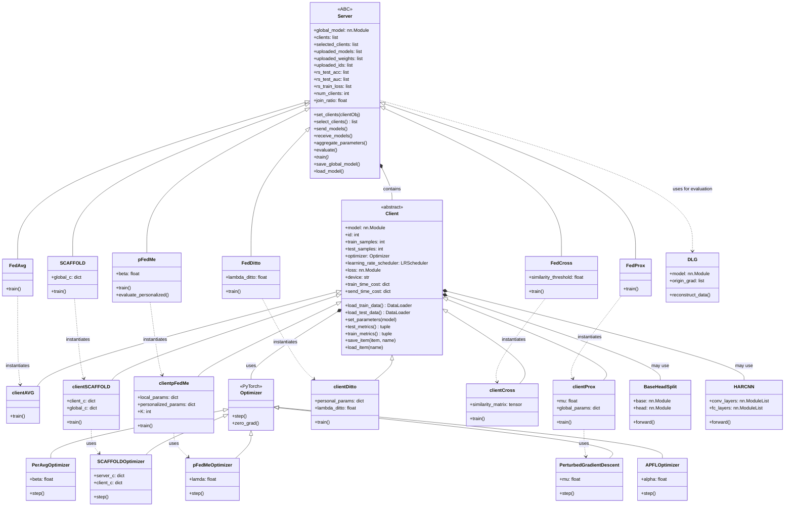

# FLCore Class Diagram

This document provides a comprehensive class diagram for the federated learning core (flcore) system architecture.

## Overview

The flcore system implements a federated learning framework with a clear separation between clients and servers. The architecture follows common design patterns including Template Method, Strategy, and Factory patterns to enable flexible algorithm implementation.

## Class Diagram



## Architecture Patterns

### 1. Template Method Pattern
- **Base classes** (`Client`, `Server`) define the common framework and workflow
- **Derived classes** implement algorithm-specific behavior by overriding key methods
- Example: All clients inherit common data loading and evaluation methods, but implement their own `train()` method

### 2. Strategy Pattern
- **Optimizers** can be plugged into clients as strategies
- Different algorithms use different optimization strategies (SGD, specialized optimizers)
- Example: `clientProx` uses `PerturbedGradientDescent`, `clientpFedMe` uses `pFedMeOptimizer`

### 3. Factory Pattern
- **Servers** instantiate appropriate client types based on algorithm
- Servers act as factories for their corresponding client implementations
- Example: `FedAvg` server instantiates `clientAVG` clients

### 4. Composition Pattern
- **Servers** contain multiple client instances
- **Clients** use optimizers and models through composition
- Enables flexible mixing of components

## Key Components

### Base Classes

#### Client (clientbase.py)
- **Purpose**: Abstract base class for all federated learning clients
- **Key Responsibilities**:
  - Local model training and evaluation
  - Data loading and preprocessing
  - Parameter synchronization with server
  - Performance tracking

#### Server (serverbase.py)
- **Purpose**: Abstract base class for all federated learning servers
- **Key Responsibilities**:
  - Global model management
  - Client selection and coordination
  - Model aggregation (typically FedAvg)
  - Evaluation and result tracking

### Algorithm Implementations

The system includes 40+ algorithm implementations, including:

- **FedAvg**: Basic federated averaging
- **FedProx**: Federated optimization with proximal regularization
- **pFedMe**: Personalized federated learning
- **SCAFFOLD**: Stochastic controlled averaging
- **FedDitto**: Federated learning with personalization
- **FedCross**: Cross-silo federated learning

### Custom Optimizers

Specialized optimizers in `fedoptimizer.py`:
- **PerAvgOptimizer**: For personalized averaging algorithms
- **SCAFFOLDOptimizer**: For SCAFFOLD with control variates
- **pFedMeOptimizer**: For pFedMe personalization
- **APFLOptimizer**: For adaptive personalized federated learning
- **PerturbedGradientDescent**: For FedProx with proximal term

### Model Architectures

Located in `trainmodel/` directory:
- **BaseHeadSplit**: Utility for splitting models into base and head components
- **HARCNN**: CNN architecture for Human Activity Recognition
- Various standard architectures (ResNet, AlexNet, MobileNet, etc.)

## Design Benefits

1. **Extensibility**: Easy to add new algorithms by inheriting from base classes
2. **Modularity**: Clear separation of concerns between clients, servers, and optimizers
3. **Reusability**: Common functionality implemented once in base classes
4. **Flexibility**: Mix and match different components (optimizers, models, algorithms)
5. **Maintainability**: Consistent interface across all implementations

## Usage Example

```python
# Server instantiates clients of the appropriate type
server = FedAvg(args)
server.set_clients(clientAVG)  # Factory pattern

# Training loop uses template method pattern
for round in range(global_rounds):
    server.select_clients()      # Strategy for client selection
    server.send_models()         # Template method
    for client in server.selected_clients:
        client.train()           # Algorithm-specific implementation
    server.receive_models()      # Template method
    server.aggregate_parameters() # Template method
    server.evaluate()           # Template method
```

This architecture enables the implementation of diverse federated learning algorithms while maintaining code consistency and reusability.